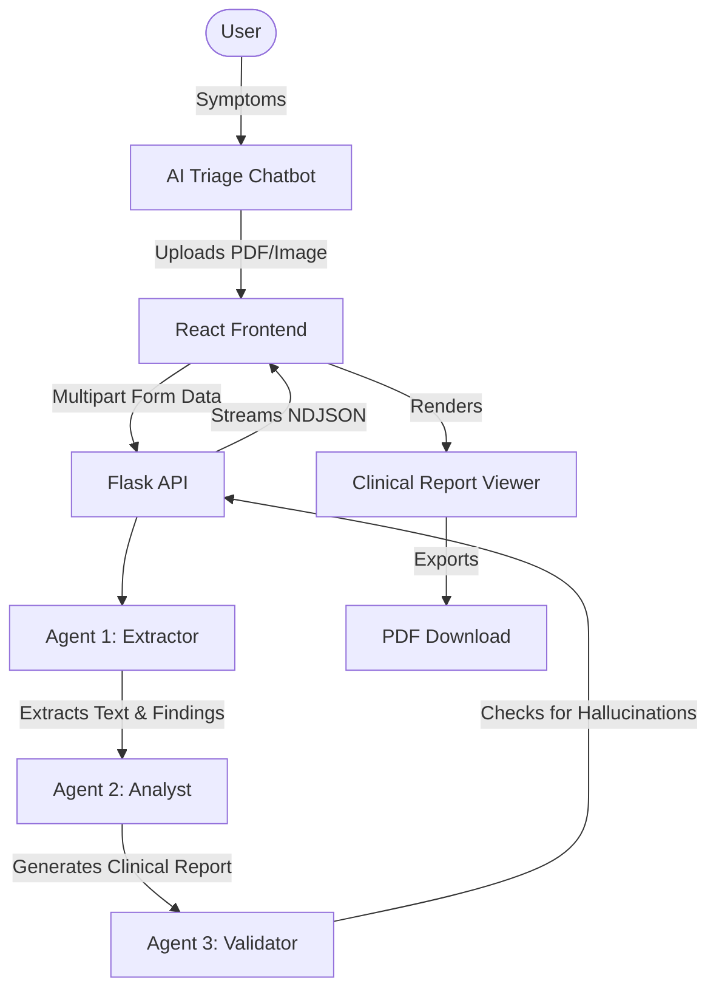

# 🩺 OmniMed AI

OmniMed AI is a next-generation medical analysis platform designed to bridge the gap between patient symptoms and complex medical data. Utilizing a multi-agent AI architecture powered by Google Gemini, the platform provides interactive symptom triage, automates the extraction of clinical findings from medical scans, and generates comprehensive, easy-to-understand clinical reports.

**🌍 Live Demo:** [https://omnimed-ai-omnimed-frontend.onrender.com](https://omnimed-ai-omnimed-frontend.onrender.com)
*(Backend API hosted at: https://omnimed-ai-omnimed-backend.onrender.com)*

## ✨ Key Features

* **💬 Interactive AI Consultation:** A ChatGPT-style triage interface that asks dynamic follow-up questions to understand patient symptoms before analysis.
* **🤖 Multi-Agent Architecture:** A system of three specialized AI agents working together to extract, analyze, and validate medical data.
* **📄 Automated Clinical Reports:** Instantly generates a clean, readable dashboard with risk scores, identified conditions, and recommended next steps.
* **💾 PDF Export:** One-click download of the generated clinical report for patients to share with their healthcare providers.
* **🎨 Premium UI/UX:** Built with a modern, responsive, and accessible glassmorphic design system.

## 🏛️ Architecture



## 🛠️ Tech Stack

**Frontend:**
* React (Vite)
* Vanilla CSS (Light Mode / Glassmorphism)
* `lucide-react` (Icons)
* `html2pdf.js` (Report Export)

**Backend:**
* Python (Flask)
* `google-genai` (Gemini 2.5 Flash API)
* `PyPDF2` (Document Parsing)
* `flask-cors` (API Routing)

## 🚀 Getting Started

### 1. Start the Backend
Navigate to the backend directory, install the Python dependencies, and add your Google Gemini API key to a `.env` file (`GEMINI_API_KEY=your_key`).
```bash
cd backend
python -m venv venv
source venv/Scripts/activate  # On Windows: .\venv\Scripts\activate
pip install -r requirements.txt
python app.py
```

### 2. Start the Frontend
Navigate to the frontend directory, install the Node dependencies, and run the development server.
```bash
cd frontend
npm install
npm run dev
```
